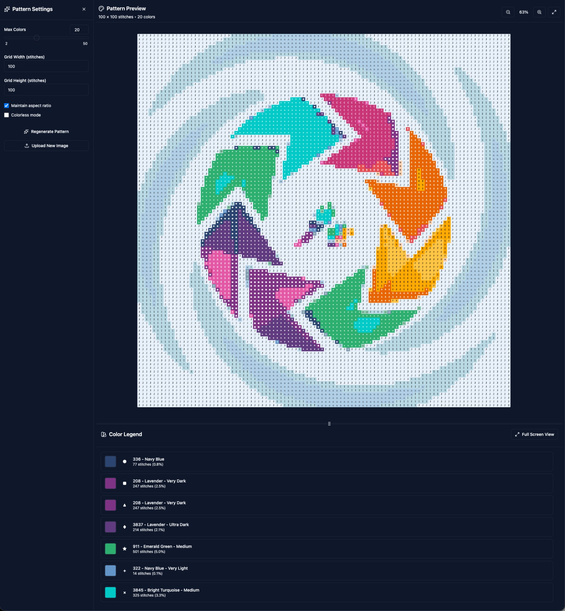

# Cross Stitch Pattern Converter

A web application that converts images to cross stitch patterns with DMC thread color matching.



## Features

- **Image Upload**: Upload images via drag-and-drop or file selection
- **Color Quantization**: K-means clustering algorithm to reduce colors
- **DMC Color Matching**: Matches colors to 445+ DMC embroidery floss colors using Delta-E 2000 algorithm
- **Grid Mapping**: Convert images to stitchable patterns with customizable dimensions
- **Symbol Assignment**: Unique symbols assigned to each color for easy pattern reading
- **Interactive Controls**: Adjust color count, grid size, and aspect ratio
- **Pattern Preview**: Real-time preview with grid and symbols
- **Color Legend**: Detailed list of DMC colors used with stitch counts

## Technologies

- **React 18** - UI framework
- **TypeScript** - Type safety
- **Vite** - Build tool
- **Zustand** - State management
- **Chroma.js** - Color manipulation and conversion
- **Canvas API** - Image processing

## Getting Started

### Installation

```bash
cd cross-stitch-converter
npm install
```

### Development

```bash
npm run dev
```

Open http://localhost:5173 in your browser.

### Build

```bash
npm run build
```

The production build will be in the `dist` directory.

## How to Use

1. **Upload an Image**: Click or drag an image onto the upload area
2. **Adjust Settings**:
   - **Max Colors**: Number of DMC thread colors to use (2-50)
   - **Grid Width/Height**: Pattern dimensions in stitches
   - **Aspect Ratio**: Keep original image proportions
3. **Generate Pattern**: Click "Generate Pattern" to create your cross stitch pattern
4. **View Results**:
   - Pattern preview with grid and symbols
   - Color legend showing DMC codes and usage statistics

## Project Structure

```
src/
├── components/          # React components
│   ├── ImageUploader    # File upload component
│   ├── ControlPanel     # Settings controls
│   ├── PatternPreview   # Canvas-based pattern display
│   └── ColorLegend      # DMC color list
├── core/               # Core algorithms
│   ├── imageProcessing/
│   │   ├── colorQuantization.ts   # K-means clustering
│   │   ├── gridMapper.ts          # Image to grid mapping
│   │   └── imageLoader.ts         # Image file handling
│   ├── colorMatching/
│   │   ├── colorDistance.ts       # Delta-E 2000
│   │   ├── colorMatcher.ts        # DMC matching
│   │   └── dmcDatabase.ts         # DMC color data
│   └── patternGeneration/
│       └── symbolAssigner.ts      # Symbol assignment
├── data/               # Static data
│   ├── dmcColors.json  # 445 DMC colors
│   └── symbols.ts      # Pattern symbols
├── store/              # State management
│   └── patternStore.ts # Zustand store
├── types/              # TypeScript definitions
└── App.tsx             # Main application
```

## Core Algorithms

### K-Means Color Quantization

- Uses k-means++ initialization for better starting centroids
- Clusters pixels in RGB color space
- Reduces image to specified number of colors
- Optimized with pixel sampling for large images

### Delta-E 2000 Color Matching

- Converts RGB colors to LAB color space
- Calculates perceptually accurate color distance
- Matches quantized colors to closest DMC thread
- Uses caching for performance

### Grid Mapping

- Area averaging for downsampling to grid dimensions
- Maps each grid cell to closest DMC color
- Maintains visual quality during size reduction
- Supports aspect ratio preservation

## Future Enhancements

- PDF export with multi-page support
- PNG image export
- Interactive color editing (remove/replace colors)
- Pattern library (save/load patterns)
- Print optimization
- Thread length calculator
- Fractional stitches support
- Backstitch layer

## License

MIT
# cross-stitch
